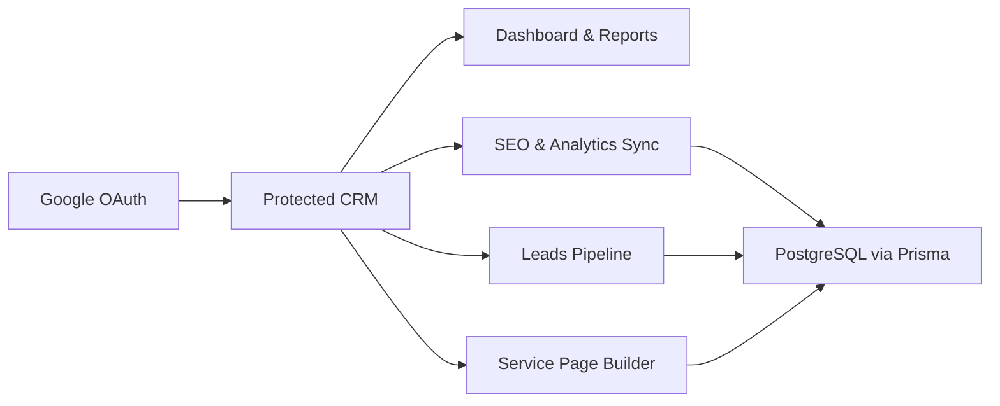

# Multi-Role CRM

A multi-user CRM and growth operations platform built for lead management, SEO monitoring, analytics reporting, website health tracking, and service-page publishing.

It combines a role-aware dashboard, Google-powered data sync, Prisma/PostgreSQL persistence, and a visual content workflow in one Next.js application.

## Why This Exists

Multi-Role CRM is designed to give one place to manage:

- inbound leads and their lifecycle
- organic search performance and keyword movement
- website traffic and audience trends
- health monitoring such as uptime and PageSpeed
- service pages and SEO-oriented content operations
- sync workflows that feed reporting and automation

## Core Modules

- Dashboard: overview cards, traffic trends, SEO trends, sources, devices, top pages, and countries
- Leads: searchable lead list, status tracking, scoring, assignment, and lead activity history
- SEO: keyword, page, opportunity, and distribution-focused workflows
- Analytics: GA4-driven reporting and realtime metrics
- Health: uptime checks, PageSpeed metrics, and technical monitoring
- Reports and Insights: aggregated operational visibility for the team
- Service Pages: visual page management with create, duplicate, import HTML, publish, and preview flows
- Alerts and Settings: operational controls and automation configuration

## Product Flow



## Tech Stack

- Next.js App Router
- React 19
- TypeScript
- Prisma with PostgreSQL
- NextAuth/Auth.js with Google sign-in
- TanStack Query
- Tailwind CSS v4
- shadcn-style UI primitives
- Recharts for dashboards
- TipTap for rich editing flows

## Authentication And Integrations

The app uses Google sign-in and requests access for:

- basic profile and email
- Google Search Console read access
- Google Analytics read access
- Google Business management access

The codebase also includes integrations for:

- Google Analytics Data API
- Google Search Console
- Google PageSpeed Insights
- Laravel-backed SEO distribution endpoints
- external AI endpoint support

## Quick Start

### 1. Install dependencies

```bash
npm install
```

### 2. Configure environment

Copy `.env.example` to `.env` and replace the placeholder values with your environment-specific credentials and URLs.

Required or commonly used variables found in the codebase:

| Variable | Purpose |
| --- | --- |
| `DATABASE_URL` | PostgreSQL connection for Prisma |
| `GOOGLE_CLIENT_ID` | Google OAuth client ID |
| `GOOGLE_CLIENT_SECRET` | Google OAuth client secret |
| `GOOGLE_SERVICE_ACCOUNT_PATH` | Path to the Google service account JSON file |
| `GA4_PROPERTY_ID` | Google Analytics 4 property ID |
| `GSC_PROPERTY` | Search Console property, for example `sc-domain:example.com` |
| `NEXT_PUBLIC_SITE_URL` | Public site URL used by health and sync flows |
| `NEXT_PUBLIC_WEBSITE_URL` | Website URL used by service page previews |
| `SYNC_SECRET` | Bearer secret used by sync and distribution endpoints |
| `GOOGLE_PAGESPEED_API_KEY` | API key for PageSpeed requests |
| `LARAVEL_API_URL` | Base URL for Laravel SEO integration |
| `LARAVEL_API_TOKEN` | API token for Laravel integration |
| `FREELLM_API_URL` | External AI endpoint URL |
| `FREELLM_API_KEY` | External AI endpoint key |

### 3. Prepare the database

```bash
npm run db:generate
npm run db:migrate
```

### 4. Verify the database connection

```bash
npm run db:test
```

### 5. Start the app

```bash
npm run dev
```

The development server runs on `http://0.0.0.0:3000`.

## Available Scripts

| Command | What it does |
| --- | --- |
| `npm run dev` | Starts the development server on port 3000 |
| `npm run build` | Creates the production build |
| `npm run start` | Starts the production server on port 3000 |
| `npm run lint` | Runs lint checks |
| `npm run db:studio` | Opens Prisma Studio |
| `npm run db:migrate` | Runs Prisma migrations in development |
| `npm run db:generate` | Regenerates the Prisma client |
| `npm run db:test` | Tests read/write database connectivity |

## Project Structure

```text
src/
	app/
		dashboard/       Main KPI and trend dashboards
		analytics/       Traffic and audience reporting
		seo/             Search performance workflows
		leads/           Lead capture and pipeline management
		health/          Uptime and PageSpeed monitoring
		reports/         Reporting views
		insights/        Insight summaries
		alerts/          Alerting surfaces
		service-pages/   Service page management and builder
		settings/        App configuration and automation docs
		api/             Internal API routes and sync endpoints
	components/        UI, dashboard, auth, leads, service-page components
	hooks/             Client-side data hooks
	lib/               Auth, DB, Google clients, AI and utility modules
	store/             Zustand state stores
prisma/
	schema.prisma      Database models
	migrations/        Prisma migrations
scripts/
	test-db.ts         Database connectivity smoke test
```

## Data Model Highlights

Prisma models in this project cover:

- users, sessions, and auth accounts
- leads and lead activities
- SEO metrics, keyword rankings, and page performance
- analytics, traffic sources, and user demographics
- uptime checks and PageSpeed snapshots
- AI insights and app settings

## Operational Notes

- The root route redirects authenticated users to `/dashboard` and guests to `/auth/login`.
- Protected routes include dashboard, SEO, analytics, leads, reports, insights, alerts, and settings surfaces.
- Sync endpoints expect a bearer token backed by `SYNC_SECRET`.
- Some modules depend on external Google or Laravel services, so local development may show partial data until credentials are configured.

## Deployment Notes

For production deployment, make sure you validate:

- environment secrets and OAuth credentials
- database connectivity and applied migrations
- outbound access to Google APIs and any external AI or Laravel services
- PM2, Docker, reverse proxy, and domain configuration if you are restoring onto an existing VM stack

## Status

This repository is positioned as the next evolution of the CRM: a multi-user operations console for leads, SEO, analytics, health monitoring, and service-page workflows.
